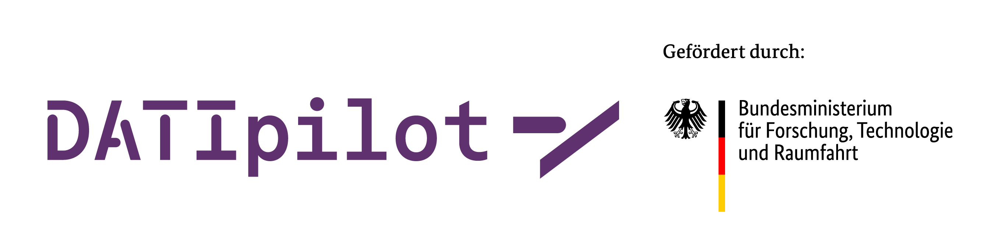

## About Teledash

Teledash is an open-source software for monitoring and analyzing anti-democratic content on Telegram channels and groups. 

It consists of three separate repositories:

- Frontend (this repository) - Web interface
- [Backend](https://github.com/ARAI-Telegram/teledash-backend) - Core API and worker services for data collection and management. See here for more information on Teledash in general
- [Processing Backend](https://github.com/ARAI-Telegram/teledash-backend-processing) (optional) - ML-powered services (semantic search, transcription, classification)

> **For a more comprehensive overview of the Teledash project** (architecture, functionalities), please refer to the [Backend repository README](https://github.com/ARAI-Telegram/teledash-backend#readme).

# Teledash Frontend

This project was bootstrapped with [Create React App](https://github.com/facebook/create-react-app).
It's based on [this boilerplate](https://github.com/alan2207/bulletproof-react/) (forked 08.01.2022)

## Development

### `npm install`

Installs all required Node modules listed in package.json.

### `npm start`

Runs the app in the development mode. Open [http://localhost:3000](http://localhost:3000) to view it in the browser. The page will reload if you make edits. You will also see any lint errors in the console.

### `npm test`

Launches the test runner in the interactive watch mode. See the section about [running tests](https://create-react-app.dev/docs/running-tests/) for more information.

### Generate Typescript types from OpenAPI schema
`npm run generate-api-types` or \
`npx openapi-typescript http://localhost:8000/openapi.json --output src/types/api.ts`

## Deployment

### `npm install`

Installs all required Node modules listed in package.json.

### `npm run build`

Builds the app for production to the `build` folder. It bundles React in production mode and optimizes the build for the best performance. The build is minified and the filenames include the hashes.

Make sure to change the *.env* file and set `VITE_API_URL` accordingly (e.g. to `api.example.com:3000`).

See [deployment](https://create-react-app.dev/docs/deployment/) for more information on continuous deployment and hosting options.

## Funding

